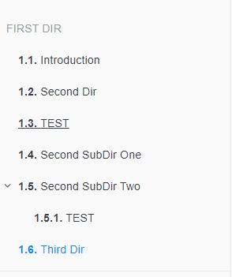

# gitbook-plugin-summary
Gitbook 的插件，自动生成SUMMARY.md

## 简介

使用目录树的结构，插件配置到book.json中

原作者不维护了，自己也不用了。就拿来改改，改成自己顺手的了。

>这里推荐大家的文件名可以通过 在文件名前，加上数字的形式，来使文件有顺序。生成目录也会按这个顺序来生成目录。


## 安装

没有push到npm库中，可以 clone 到 node_modules 目录中。


然后在 book.json 中添加插件


```json
{
  "plugins": [
    "summary"
  ]
}
```

然后就可以愉快的玩耍了。

```shell
$ gitbook serve
```

## 规则

### 命名

* **0-README.md**: 会作为当前目录名的文件
* **markdown文件**: 使用文件的第一个一级标题，作为文件名 (ex: `# title`)

#### 目录为root目录，就是和book.json在同一层级的目录

* 有**0-README.md**，会作为一个普通的导航链接
* 没有**0-README.md**，会作为一个分区标题

#### 次级目录，root目录下的目录

* 有**0-README.md**，会作为一个普通的导航链接
* 没有**0-README.md**，会成功一个普通的label，没有链接（禁用的链接），（无论这个目录下还有没有其他文件，都不会显示出来了）

#### 文件

* 只有markdown文件才会展示


## 属性

加了几个属性配置：

```json
"pluginsConfig": {
	"summary" : {
		"excludeDir":["assets","styles"],
		"readme":"0-README.md"
	}
}
```

* **excludeDir** 需要排除的目录，有些目录是用来放其他文件的，则排除掉，不生成目录，默认已经排除的目录：[ 'node_modules/**', '_book', '_layouts', '**/img' ]
* **readme** 默认使用"0-README.md" 来校验文件名，如果有其他个人的命名习惯，可以在这里修改。


## 举个栗子


```shell
$ tree .
.
├── First-Dir
├── Second-Dir
│   ├── 0-README.md
│   ├── 1-TEST.md
│   ├── Second-SubDir-one
│   └── Second-SubDir-two
│       ├── 0-README.md
│       └── 1-TEST.md
├── Third-Dir
│   └── 0-README.md
├── README.md
└── SUMMARY.md
```

生成的 **SUMMARY.md** 就是这样子的：


your **SUMMARY.md** file will look like this:

```markdown

## First Dir

- [Second Dir](Second-Dir/0-README.md)
- [TEST](Second-Dir/1-TEST.md)
- [Second SubDir One]()
- [Second SubDir Two](Second-Dir/Second-SubDir-two/0-README.md)
    - [TEST](Second-Dir/Second-SubDir-two/1-TEST.md)
- [Third Dir](Third-Dir/0-README.md)
```


这里再解释一下：
* First-Dir ：是root目录，没有0-README.md 文件，那么会作为一个 分区标题，First-Dir目录下有文件，会正常展示的
* Second-Dir ： 是root目录，有0-README.md 文件,那么就会做为一个导航链接存在。
> 这里有个注意点：Second-Dir 这个root目录，由于有了0-README.md这个文件存在，就不再是root目录了，而是一个普通的导航链接了。
> 就是降级了，和它的子文件1-TEST.md是同级文件了。所以Second Dir和Test是同级的。
Second-SubDir-one：不是root目录，同时也没有子文件，那么就做为一个label存在，（禁用的链接）
Second-SubDir-two：不是root目录，有子文件，【那么就会产生目录层级了】。

* Third-Dir ：是root目录，有0-README.md 文件,那么就会做为一个导航链接存在
and this is how it will be shown inside your Gitbook:



## Troubleshooting

* Code span (with the back ticks) won't be recognize. So better avoid until someone find it
  important enough to fix that :P

* If it seems like it's not rerendering, save again. Changes are taken into account on the second
  server restart.

* `unexpected token function`: This is caused by the only async-await in the code. 2 ways of fixing
  it. First, install Node 7.6+. Second, pull request it. It's only a 2-3 lines change :)

  
 
